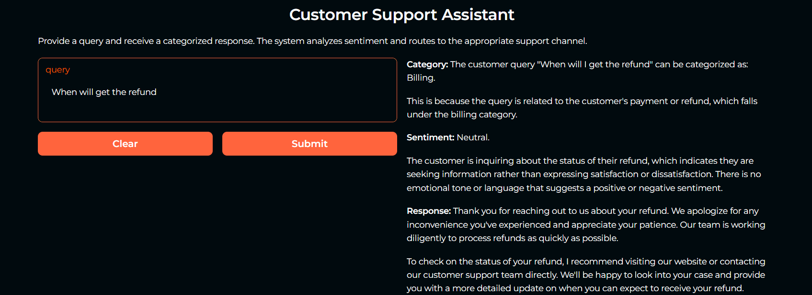
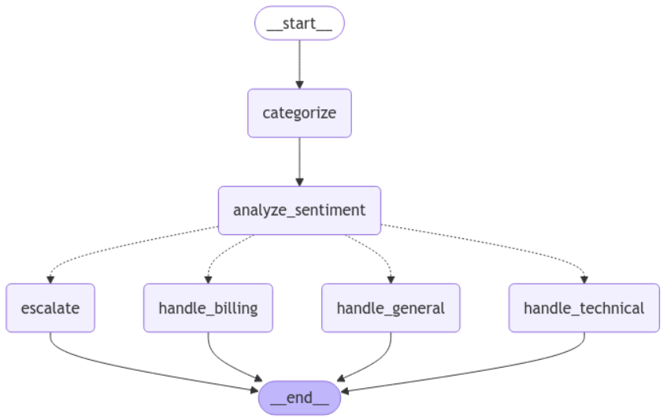

# Customer-Support-AI-Agents-LangChain

A Gradio-based intelligent support system that automatically categorizes, analyzes sentiment, and routes customer queries using LangChain and LLM. Simply input your query to receive appropriate support responses.

### Project Demo

### Features

🎯 Automatic query categorization (Technical, Billing, General)

😊 Sentiment analysis integration

⚡ Smart routing based on query type and sentiment

👤 Automatic escalation for negative sentiment

🖥️ Clean web interface using Gradio

### How It Works
The system processes queries through a sophisticated workflow:

- Query Categorization (Technical/Billing/General)

- Sentiment Analysis (Positive/Neutral/Negative)

- Smart Routing:

    Negative sentiment → Human escalation

    Technical issues → Technical support

    Billing queries → Billing department

    General queries → General support

